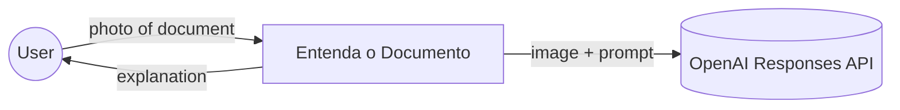

# C1 - System Context

## Context
The system helps users understand bureaucratic documents by sending an image to an AI model and returning a simple explanation in Portuguese.

## Diagram

```mermaid
flowchart LR
  User((User)) -->|photo of document| App[Entenda o Documento]
  App -->|image + prompt| OpenAI[(OpenAI Responses API)]
  App -->|explanation| User
```
