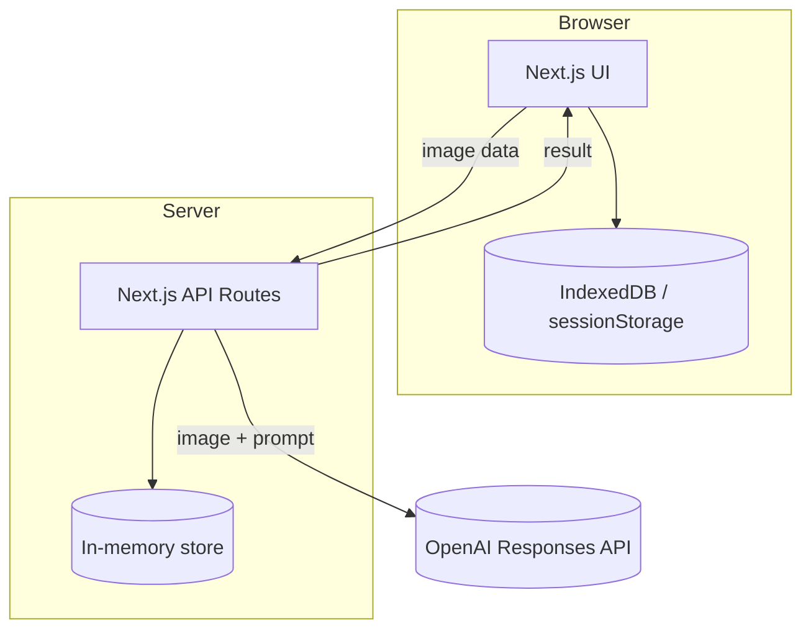

# C2 - Containers

## Containers
- Web App (Next.js App Router)
- API Routes (Next.js, Node runtime)
- OpenAI Responses API
- Client Storage (IndexedDB + sessionStorage)

## Diagram

```mermaid
flowchart TB
  subgraph Browser
    UI[Next.js UI]
    Storage[(IndexedDB / sessionStorage)]
  end

  subgraph Server
    API[Next.js API Routes]
    Memory[(In-memory store)]
  end

  UI -->|image data| API
  API --> Memory
  API -->|image + prompt| OpenAI[(OpenAI Responses API)]
  API -->|result| UI
  UI --> Storage
```
