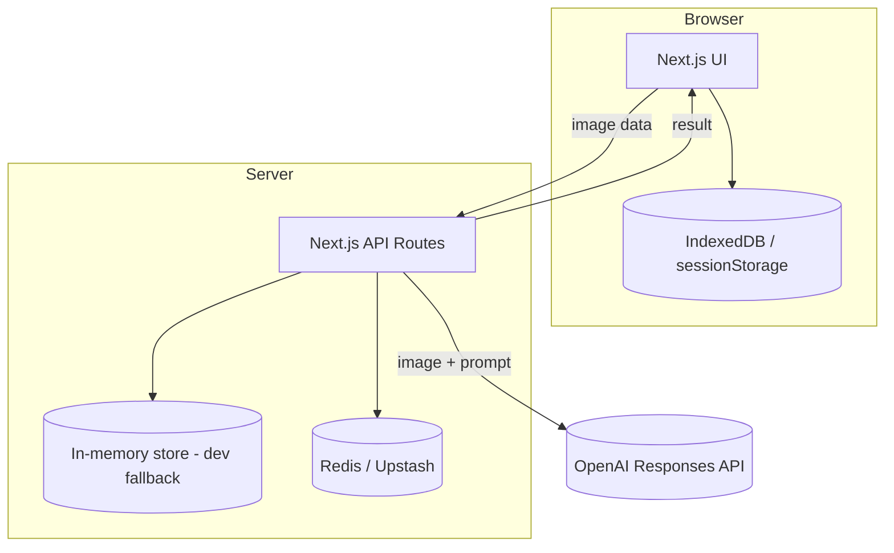

# C2 - Containers

## Containers
- Web App (Next.js App Router)
- API Routes (Next.js, Node runtime)
- OpenAI Responses API
- Redis (Upstash) for temporary capture storage
- Client Storage (IndexedDB + sessionStorage)

## Diagram

