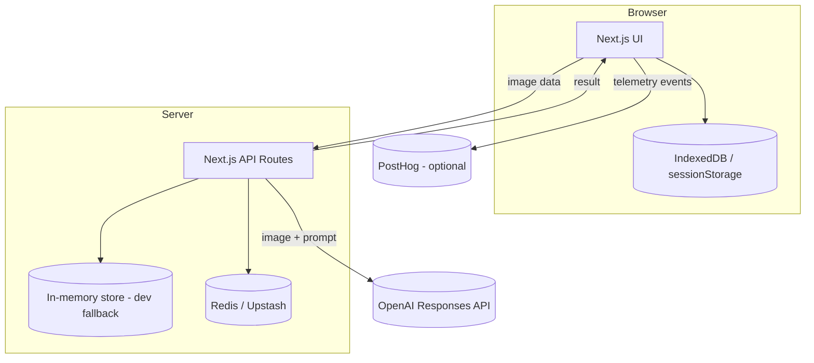

# C2 - Containers

## Containers
- Web App (Next.js App Router)
- API Routes (Next.js, Node runtime)
- OpenAI Responses API
- Redis (Upstash) for capture storage, rate limiting, and aggregated counters
- PostHog (optional) for telemetry events
- Client Storage (IndexedDB + sessionStorage)

## Diagram

