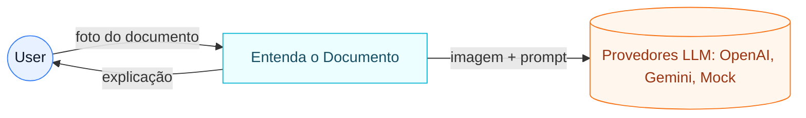

# C1 - Contexto do Sistema

## Contexto
O sistema ajuda pessoas a entender documentos burocráticos ao enviar uma imagem para um modelo de IA e devolver uma explicação simples em português.

## Diagrama

