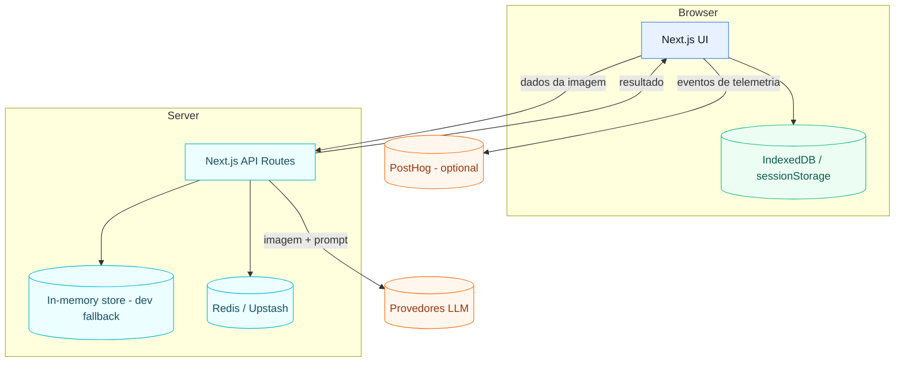

# C2 - Containers

## Containers
- Web App (Next.js App Router)
- API Routes (Next.js, Node runtime)
- Provedores LLM (OpenAI, Gemini, Mock)
- Redis (Upstash) para armazenamento de capturas, rate limit e contadores agregados
- PostHog (opcional) para eventos de telemetria
- Armazenamento no cliente (IndexedDB + sessionStorage)

## Diagrama

