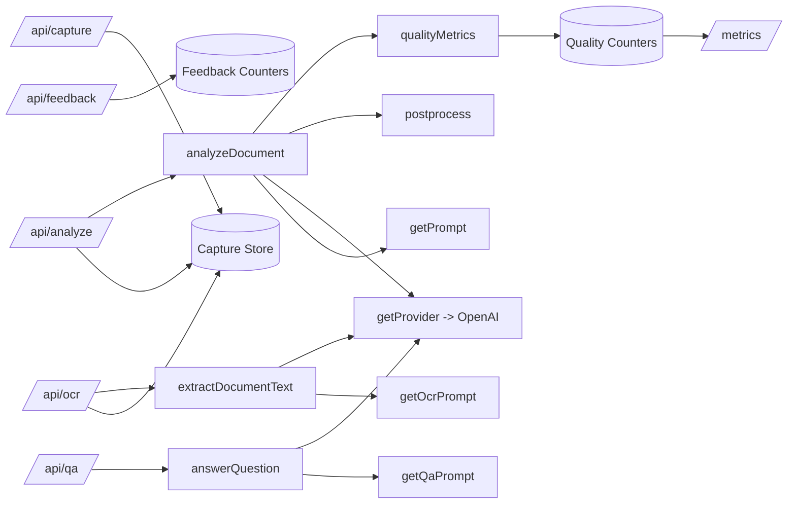

# C3 - Components

## Server Components (API Routes)
- /api/session-token: issues short-lived session token
- /api/capture: validates and stores image data (short TTL)
- /api/ocr: loads image data and extracts document text (OCR via LLM)
- /api/analyze: loads image data and calls AI pipeline
- /api/qa: answers questions based on extracted context
- /api/feedback: stores aggregated user feedback
- /api/health: simple health check
- /metrics: internal dashboard for quality counters

## AI Pipeline Components
- Prompt registry (src/ai/prompts)
- Provider adapter (src/ai/providers)
- Postprocess and safety softening (src/ai/postprocess.ts)
- OCR extraction (src/ai/extractDocumentText.ts)
- Q&A answering (src/ai/answerQuestion.ts)
- Quality metrics aggregation (src/lib/qualityMetrics.ts)

## Cross-cutting Components
- Rate limiting (src/lib/rateLimit.ts)
- Session token auth + origin checks (src/lib/requestAuth.ts)
- Client storage (src/lib/captureStore.ts, src/lib/resultStore.ts, src/lib/captureIdStore.ts)
- Telemetry (src/lib/telemetry.ts, src/app/providers.tsx)

## Diagram

