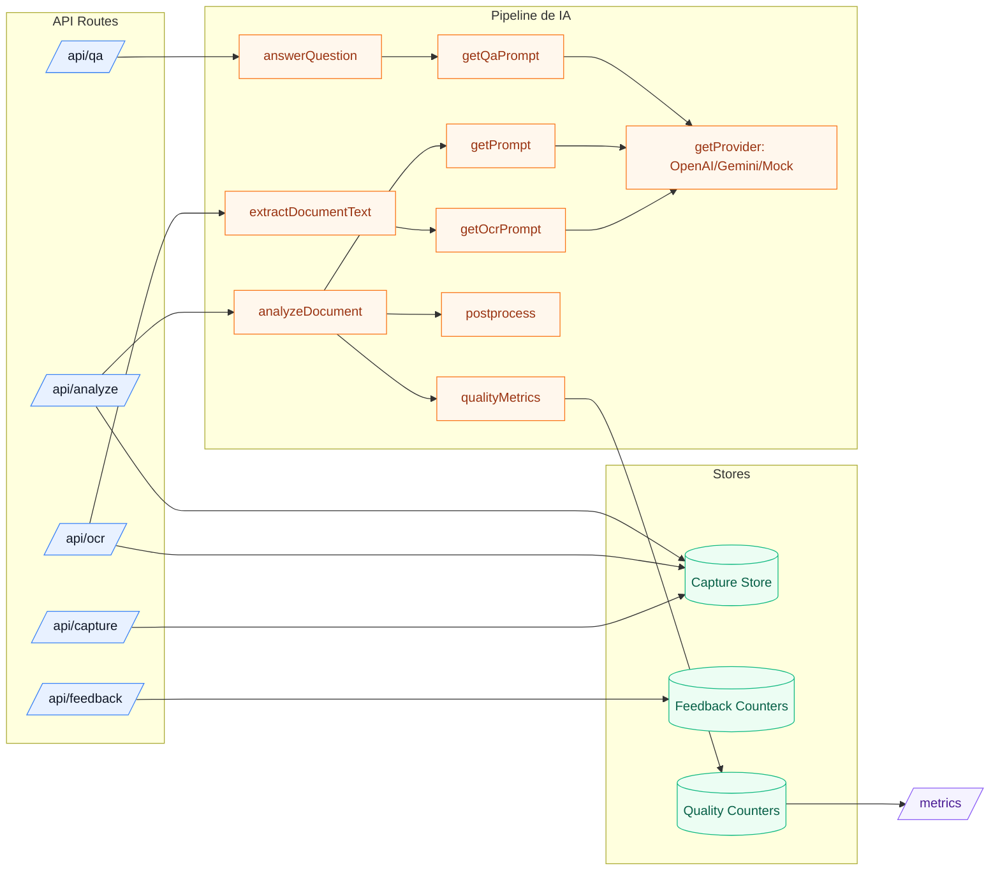

# C3 - Componentes

## Componentes do servidor (API Routes)
- /api/session-token: emite token de sessão de curta duração
- /api/capture: valida e armazena imagem (TTL curto)
- /api/ocr: carrega imagem e extrai texto (OCR via LLM)
- /api/analyze: carrega imagem e executa pipeline de IA
- /api/qa: responde perguntas com base no contexto extraído
- /api/feedback: registra feedback agregado
- /api/health: health check simples
- /metrics: dashboard interno de contadores de qualidade

## Componentes do pipeline de IA
- Registro de prompts (src/ai/prompts)
- Adaptador de provedores (src/ai/providers)
- Postprocess e suavização de linguagem (src/ai/postprocess.ts)
- Extração OCR (src/ai/extractDocumentText.ts)
- Respostas de Q&A (src/ai/answerQuestion.ts)
- Agregação de métricas de qualidade (src/lib/qualityMetrics.ts)

## Componentes transversais
- Rate limiting (src/lib/rateLimit.ts)
- Auth de token de sessão + verificação de origem (src/lib/requestAuth.ts)
- Armazenamento no cliente (src/lib/captureStore.ts, src/lib/resultStore.ts, src/lib/captureIdStore.ts)
- Telemetria (src/lib/telemetry.ts, src/app/providers.tsx)

## Diagrama

