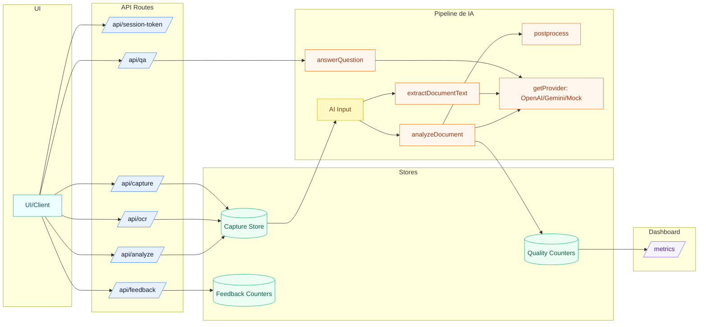

# C4 - Código (Fluxos Principais)

## Fluxo: Captura -> Análise -> Resultado
1) O app solicita um token de curta duração em /api/session-token.
2) O usuário seleciona uma foto e confirma.
3) /api/capture valida base64, checa origem/token e armazena em Redis com TTL (fallback em memória no dev).
4) /api/ocr checa origem/token, busca a imagem no Redis e extrai documentText para Q&A.
5) /api/analyze checa origem/token, busca a imagem no Redis e:
   - quando ANALYZE_TEXT_ONLY=1 e o OCR é suficiente, chama analyzeDocument com texto.
   - caso contrário, usa imagem (fallback quando OCR está incompleto).
6) analyzeDocument chama o provider (OpenAI, Gemini ou Mock) e o postprocess, registrando contadores de qualidade.
7) O resultado é salvo no sessionStorage e renderizado em /result.
8) Opcional: /api/qa responde perguntas usando contexto OCR (fallback para cards).
9) Opcional: /api/feedback registra thumbs up/down com motivo (agregado).
10) /metrics lê contadores agregados e renderiza um dashboard simples.

## Diagrama (fluxo de código)

## Arquivos-chave
- src/app/api/capture/route.ts
- src/app/api/ocr/route.ts
- src/app/api/analyze/route.ts
- src/app/api/qa/route.ts
- src/app/api/feedback/route.ts
- src/app/api/session-token/route.ts
- src/app/metrics/page.tsx
- src/ai/analyzeDocument.ts
- src/ai/extractDocumentText.ts
- src/ai/answerQuestion.ts
- src/ai/providers/openaiProvider.ts
- src/ai/providers/geminiProvider.ts
- src/ai/providers/mockProvider.ts
- src/ai/postprocess.ts
- src/ai/prompts/entendaDocumento.text.v1.ts
- src/ai/prompts/entendaDocumento.v1.ts
- src/ai/prompts/entendaDocumento.ocr.v1.ts
- src/ai/prompts/entendaDocumento.qa.v1.ts
- src/lib/captureStoreServer.ts
- src/lib/captureStore.ts
- src/lib/ocrTextQuality.ts
- src/lib/qualityMetrics.ts
- src/lib/qaContextStore.ts
- src/lib/resultStore.ts
- src/lib/requestAuth.ts
- src/lib/sessionToken.ts
