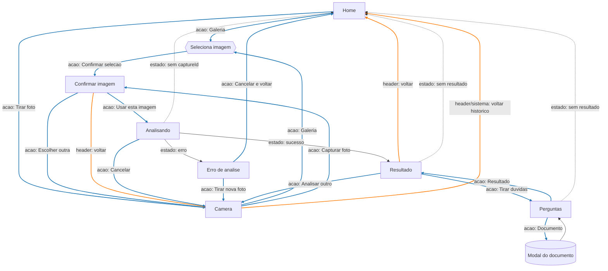
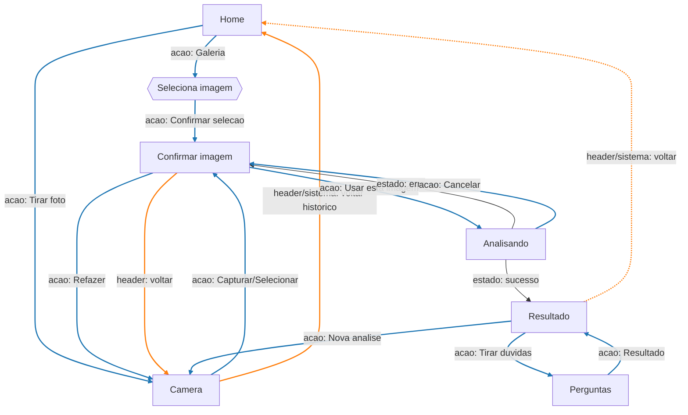

# Fluxo da aplicacao

## Fluxo atual (referencia)
Legenda rapida: "acao" = botoes principais, "header" = seta do topo, "sistema" = voltar do navegador, "estado" = desvio automatico. Cores: azul = acao, laranja = header/sistema.

## Proposta simplificada (para avaliacao)
Legenda rapida: "acao" = botoes principais, "header" = seta do topo, "sistema" = voltar do navegador, "estado" = desvio automatico. Cores: azul = acao, laranja = header/sistema.

